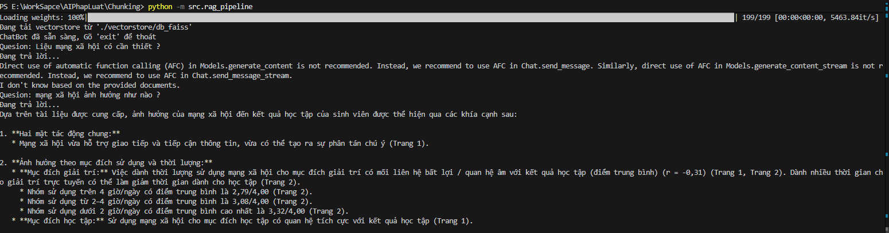

# RAG ChatBot - Vietnamese Document Q&A Assistant

Hệ thống Hỏi - Đáp thông minh (Retrieval-Augmented Generation - RAG) tối ưu hóa cho tài liệu tiếng Việt (văn bản học thuật, nghiên cứu, pháp luật) sử dụng **LangChain**, mô hình nhúng **BKAI Foundation Bi-Encoder**, cơ sở dữ liệu vector **FAISS** và mô hình ngôn ngữ **Google Gemini**.
</img>
---

## Tính Năng Nổi Bật

- **Đa dạng chiến lược Chunking (Document Splitting)**:
  - **Header Chunking**: Tách tài liệu theo cấp bậc tiêu đề (Markdown Headers) kết hợp `RecursiveCharacterTextSplitter`.
  - **Semantic Chunking**: Phân đoạn tài liệu thông minh dựa trên sự thay đổi ngữ nghĩa và độ tương đồng giữa các câu.
- **Mô hình Embedding Tiếng Việt Chuyên Biệt**: Tích hợp `bkai-foundation-models/vietnamese-bi-encoder` chuẩn hóa khoảng cách Cosine, cho khả năng truy xuất ngữ nghĩa tiếng Việt chính xác.
- **Trích Xuất PDF Tự Động**: Nạp và xử lý tự động toàn bộ tài liệu PDF trong thư mục dữ liệu với `pypdf`.
- **Chống Ảo Giác & Trích Dẫn Nguồn**: Hệ thống Prompt chuẩn hóa, yêu cầu LLM chỉ trả lời dựa trên ngữ cảnh được cung cấp và trích dẫn số trang/nguồn cụ thể.
- **Kiến Trúc Module Hóa (Clean Architecture)**: Tách biệt rõ ràng các tầng: Chunking, Embedding/VectorStore và RAG Pipeline.

---

## Cấu Trúc Thư Mục Dự Án

```text
├── data/                       # Thư mục chứa tài liệu PDF đầu vào
│   ├── bai_bao_khoa_hoc_1.pdf
│   └── bai_bao_khoa_hoc_2.pdf
├── src/
│   ├── chunking/               # Các chiến lược chia nhỏ văn bản
│   │   ├── headerChunking.py   # Header & Recursive Text Splitter
│   │   └── sematicChunking.py  # Semantic Chunker
│   ├── embedding.py            # Khởi tạo Embedding & Quản lý FAISS VectorStore
│   └── rag_pipeline.py         # Pipeline RAG hoàn chỉnh & CLI Chatbot
├── vectorstore/                # Nơi lưu trữ chỉ mục FAISS local
│   └── db_faiss/
├── all_chunks_debug.json       # File xuất chi tiết các chunk sau khi phân đoạn (debug)
├── requirements.txt            # Danh sách thư viện phụ thuộc
├── .env                        # Biến môi trường (chứa Google API Key)
└── README.md
```

---

## 🚀 Hướng Dẫn Cài Đặt & Sử Dụng

### 1. Yêu cầu hệ thống
- **Python**: `>= 3.10`
- **Git**

### 2. Cài đặt môi trường

Clone dự án về máy:
```bash
git clone https://github.com/ZDragon098/RAG_ChatBot.git
cd RAG_ChatBot
```

Tạo môi trường ảo (khuyên dùng):
```bash
python -m venv venv
# Trên Windows:
.\venv\Scripts\activate
# Trên Linux/macOS:
source venv/bin/activate
```

Cài đặt các gói phụ thuộc:
```bash
pip install -r requirements.txt
```

### 3. Cấu hình biến môi trường (`.env`)

Tạo tệp `.env` tại thư mục gốc của dự án và điền Google Gemini API Key:
```env
GOOGLE_API_KEY=your_gemini_api_key_here
```
> *Lấy Google Gemini API Key miễn phí tại [Google AI Studio](https://aistudio.google.com/).*

### 4. Chuẩn bị dữ liệu
Đặt các tệp tài liệu PDF bạn muốn phân tích vào thư mục `data/`.

### 5. Khởi chạy RAG ChatBot

Chạy ứng dụng từ thư mục gốc:
```bash
python -m src.rag_pipeline
```

- **Lần chạy đầu tiên**: Hệ thống sẽ tự động quét tài liệu trong `data/`, thực hiện chunking, tính toán vector embedding và lưu vào `vectorstore/db_faiss/`.
- **Các lần chạy tiếp theo**: Hệ thống sẽ tự động nạp cơ sở dữ liệu vector đã có sẵn, giúp khởi động gần như tức thì.

---

## 💡 So Sánh Các Chiến Lược Chunking Trong Dự Án

| Phương Pháp | Ưu Điểm | Nhược Điểm | Khi Nào Nên Dùng? |
| :--- | :--- | :--- | :--- |
| **Header Chunking** | Tốc độ xử lý nhanh, giữ đúng phân cấp logic (Chương, Mục, Điều) | Cần tài liệu có cấu trúc tiêu đề rõ ràng | Tài liệu học thuật, văn bản quy phạm pháp luật, hợp đồng |
| **Semantic Chunking** | Đảm bảo mỗi chunk là một khối ý nghĩa trọn vẹn, không cắt ngang ý | Tốn thời gian tính toán embedding nhiều hơn | Văn bản dạng tự sự, bài viết phân tích, báo chí |

---

## Công Nghệ Sử Dụng

- **Framework**: [LangChain](https://www.langchain.com/) (LangChain Core, LangChain Community, LangChain Text Splitters)
- **Vector Database**: [FAISS (Facebook AI Similarity Search)](https://github.com/facebookresearch/faiss)
- **Embedding Model**: [BKAI Foundation Models - Vietnamese Bi-Encoder](https://huggingface.co/bkai-foundation-models/vietnamese-bi-encoder)
- **LLM**: Google Gemini (`gemini-3.6-flash`)
- **PDF Parser**: `pypdf`

---

## Lộ Trình Phát Triển (Roadmap)

- [ ] Hỗ trợ Re-ranking (BGE-Reranker tiếng Việt) để tăng độ chính xác tìm kiếm.
- [ ] Mở rộng Vector Database sang **PostgreSQL với pgvector**.
- [ ] Xây dựng giao diện tương tác người dùng qua **Streamlit** / **Gradio** hoặc Web API với **FastAPI**.
- [ ] Bổ sung cơ chế lưu lịch sử hội thoại (Chat History / Conversational Memory).

---

